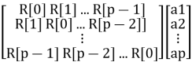
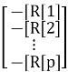

<!DOCTYPE html>
<html lang="en">
<head>
  <meta charset="UTF-8">
  <meta name="viewport" content="width=device-width, initial-scale=1.0">
  <link href="https://cdn.jsdelivr.net/npm/tailwindcss@2.2.19/dist/tailwind.min.css" rel="stylesheet">
</head>
<body>
<h3 style="margin-top:24pt; margin-bottom:0pt; text-align:center; page-break-inside:avoid; page-break-after:avoid; font-size:18pt;"><a name="yule-walker-estimation">Yule-Walker Estimation</a></h3>

The&nbsp;<strong>Yule-Walker Method</strong>&nbsp;for spectral estimation is based on the assumption that the signal can be modeled as an&nbsp;<em>autoregressive (AR) process</em>. Below is the step-by-step explanation.

&nbsp;

<h3 style="margin-top:10pt; margin-bottom:0pt; page-break-inside:avoid; page-break-after:avoid; font-size:16pt;"><a name="autoregressive-ar-model">1. Autoregressive (AR) Model</a></h3>

An AR process of order p is defined as:

x[n] = -&sum;k=1p&nbsp;ak&nbsp;x[n-k] + e[n]

Where:

&bull;&nbsp;&nbsp;&nbsp;&nbsp;&nbsp;&nbsp;&nbsp;&nbsp;&nbsp;&nbsp;&nbsp;&nbsp;&nbsp;<strong>x[n]</strong>: Signal at time n.

&bull;&nbsp;&nbsp;&nbsp;&nbsp;&nbsp;&nbsp;&nbsp;&nbsp;&nbsp;&nbsp;&nbsp;&nbsp;&nbsp;<strong>a</strong><strong>k</strong>: AR model coefficients to be estimated.

&bull;&nbsp;&nbsp;&nbsp;&nbsp;&nbsp;&nbsp;&nbsp;&nbsp;&nbsp;&nbsp;&nbsp;&nbsp;&nbsp;<strong>p</strong>: Order of the AR model (number of past samples used).

&bull;&nbsp;&nbsp;&nbsp;&nbsp;&nbsp;&nbsp;&nbsp;&nbsp;&nbsp;&nbsp;&nbsp;&nbsp;&nbsp;<strong>e[n]</strong>: White noise (residual error).

&nbsp;

<h3 style="margin-top:10pt; margin-bottom:0pt; page-break-inside:avoid; page-break-after:avoid; font-size:16pt;"><a name="autocorrelation-function">2. Autocorrelation Function</a></h3>

The AR model is closely linked to the&nbsp;<strong>autocorrelation function</strong>, which measures how similar the signal is to itself at different time lags:

R[k] = E[x[n] x[n-k]]

For a wide-sense stationary process, R[k] depends only on the lag k, not on n.

&nbsp;

<h3 style="margin-top:10pt; margin-bottom:0pt; page-break-inside:avoid; page-break-after:avoid; font-size:16pt;"><a name="yule-walker-equations">3. Yule-Walker Equations</a></h3>

The Yule-Walker equations relate the AR coefficients a_k to the autocorrelation values R[k]:

&nbsp;=&nbsp;&nbsp;

&nbsp;

This forms a system of linear equations:

&bull;&nbsp;&nbsp;&nbsp;&nbsp;&nbsp;&nbsp;&nbsp;&nbsp;&nbsp;&nbsp;&nbsp;&nbsp;&nbsp;<strong>Left matrix</strong>: Toeplitz matrix of autocorrelation values.

&bull;&nbsp;&nbsp;&nbsp;&nbsp;&nbsp;&nbsp;&nbsp;&nbsp;&nbsp;&nbsp;&nbsp;&nbsp;&nbsp;<strong>Right-hand side</strong>: Negative autocorrelation values for lags 1 to p.

&nbsp;

<h3 style="margin-top:10pt; margin-bottom:0pt; page-break-inside:avoid; page-break-after:avoid; font-size:16pt;"><a name="solving-for-a_k">4. Solving for ak</a></h3>

To solve for the AR coefficients ak, use the autocorrelation values. The residual noise variance &sigma;e2&nbsp;is calculated as:

&sigma;e2&nbsp;= R[0] + &sum;k=1p&nbsp;ak&nbsp;R[k].

&nbsp;

<h3 style="margin-top:10pt; margin-bottom:0pt; page-break-inside:avoid; page-break-after:avoid; font-size:16pt;"><a name="power-spectral-density-psd">5. Power Spectral Density (PSD)</a></h3>

The power spectral density (PSD) is computed as:

P(f) = &sigma;e2&nbsp;/ |1 + &sum;k=1p&nbsp;ak&nbsp;e-j2&pi;fk|2

This shows how power is distributed across frequencies using the AR coefficients ak&nbsp;and the noise variance &sigma;e2.

&nbsp;

<h3 style="margin-top:10pt; margin-bottom:0pt; page-break-inside:avoid; page-break-after:avoid; font-size:16pt;"><a name="key-intuitions">Key Intuitions</a></h3>

&bull;&nbsp;&nbsp;&nbsp;&nbsp;&nbsp;&nbsp;&nbsp;&nbsp;&nbsp;&nbsp;&nbsp;&nbsp;&nbsp;<strong>Autoregression</strong>: Yule-Walker assumes the signal can be predicted using its past values.

&bull;&nbsp;&nbsp;&nbsp;&nbsp;&nbsp;&nbsp;&nbsp;&nbsp;&nbsp;&nbsp;&nbsp;&nbsp;&nbsp;<strong>Autocorrelation</strong>: Relates the past values of the signal to the current value through R[k].

&bull;&nbsp;&nbsp;&nbsp;&nbsp;&nbsp;&nbsp;&nbsp;&nbsp;&nbsp;&nbsp;&nbsp;&nbsp;&nbsp;<strong>PSD</strong>: Transforms time-domain properties (autocorrelation) into frequency-domain characteristics (PSD).

&nbsp;

<h3 style="margin-top:10pt; margin-bottom:0pt; page-break-inside:avoid; page-break-after:avoid; font-size:16pt;"><a name="steps-in-practice">Steps for the Calculation of PSD</a></h3>
<ol type="1" style="margin:0pt; padding-left:0pt;">
    <li style="margin-top:1.8pt; margin-left:27.5pt; margin-bottom:1.8pt; padding-left:8.5pt; font-family:'Times New Roman'; font-size:14pt;">Estimate R[k] (autocorrelation values) from the signal.</li>
    <li style="margin-top:1.8pt; margin-left:27.5pt; margin-bottom:1.8pt; padding-left:8.5pt; font-family:'Times New Roman'; font-size:14pt;">Solve the Yule-Walker equations to find ak.</li>
    <li style="margin-top:1.8pt; margin-left:27.5pt; margin-bottom:1.8pt; padding-left:8.5pt; font-family:'Times New Roman'; font-size:14pt;">Use ak and &sigma;e2&nbsp;to compute the PSD.</li>
</ol>

This is the mathematical foundation of the Yule-Walker spectral estimation method, which is efficient and works well for stationary signals.

</body>
</html>
